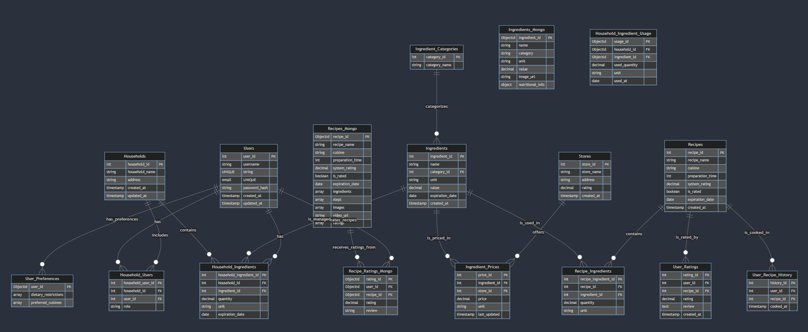

# Introduction

This document provides a comprehensive overview of the SQL and NoSQL database design for the Smart Kitchen Helper project. It includes detailed schema diagrams, table definitions, MongoDB collections, and a thorough explanation of the constraints, business rules, and potential joins that govern the system. The goal is to ensure that the system is scalable, maintainable, and capable of efficiently managing the data required for the application's features.

**Author:** Amit Christian  
**Course:** Cloud Computing, Durham College  
**Student ID:** 100937637

# SQL Database Design

## Conceptual Design

The SQL database is designed to handle structured data, such as user profiles, households, ingredients, recipes, and additional entities like stores, prices, and ingredient categories. Constraints and rules are implemented to enforce data integrity and business logic.

### ER Diagram
```{r, echo=FALSE, out.width='100%'}

```

### Entities and Relationships

- **Users:** Manages user profiles, including personal details and authentication information.
- **Households:** Represents a group of users, typically members of a family or shared living space, that manages a collective inventory of ingredients.
- **Ingredients:** Contains the list of ingredients available in each household, categorized by type (e.g., veggie, dairy, meat) along with quantities, units, and expiration dates.
- **Recipes:** Stores basic information about recipes, including names, cuisines, preparation times, system ratings, and whether the recipe is rated by users.
- **Stores:** Manages information about stores where ingredients can be purchased, including address and ratings.
- **Ingredient_Prices:** Tracks the price of ingredients at various stores, including units and last updated timestamps.
- **Recipe_Ingredients:** A join table that connects recipes with their required ingredients.
- **Household_Ingredients:** Manages the inventory of ingredients within each household, including quantities, units, and expiration dates.
- **User_Recipe_History:** Logs the history of recipes cooked by users, allowing them to track their culinary activities over time.
- **User_Ratings:** Collects individual user ratings for recipes, including a text review.

## SQL Table Schemas with Constraints, Rules, and Logical Details

Below are the detailed table schemas for the SQL database, including constraints, business rules, and explanations of logical joins and null handling.

### 1. Users Table

```sql
CREATE TABLE Users (
    user_id INT PRIMARY KEY AUTO_INCREMENT,
    username VARCHAR(50) UNIQUE NOT NULL,
    email VARCHAR(100) UNIQUE NOT NULL CHECK (email LIKE '%_@__%.__%'),
    password_hash VARCHAR(255) NOT NULL,
    created_at TIMESTAMP DEFAULT CURRENT_TIMESTAMP,
    updated_at TIMESTAMP DEFAULT CURRENT_TIMESTAMP ON UPDATE CURRENT_TIMESTAMP
);
```

**Constraints and Rules:**
- **Unique Constraints:** `username` and `email` must be unique.
- **Email Format Validation:** Ensures that email addresses follow a valid format.
- **Not Null:** Ensures that all required fields are filled.

### 2. Households Table

```sql
CREATE TABLE Households (
    household_id INT PRIMARY KEY AUTO_INCREMENT,
    household_name VARCHAR(100) NOT NULL,
    address VARCHAR(255),
    created_at TIMESTAMP DEFAULT CURRENT_TIMESTAMP,
    updated_at TIMESTAMP DEFAULT CURRENT_TIMESTAMP ON UPDATE CURRENT_TIMESTAMP
);
```

**Constraints and Rules:**
- **Not Null:** The `household_name` must be provided.
- **Timestamp Defaults:** Automatically track when households are created and updated.

### 3. Household_Users Table

```sql
CREATE TABLE Household_Users (
    household_user_id INT PRIMARY KEY AUTO_INCREMENT,
    household_id INT,
    user_id INT,
    role ENUM('owner', 'member') DEFAULT 'member',
    FOREIGN KEY (household_id) REFERENCES Households(household_id) ON DELETE CASCADE,
    FOREIGN KEY (user_id) REFERENCES Users(user_id) ON DELETE CASCADE
);
```

**Constraints and Rules:**
- **Foreign Keys:** Links users to households, with cascading deletes to maintain referential integrity.
- **Role Constraint:** Limits the role to either 'owner' or 'member'.

### 4. Ingredient_Categories Table

```sql
CREATE TABLE Ingredient_Categories (
    category_id INT PRIMARY KEY AUTO_INCREMENT,
    category_name VARCHAR(50) UNIQUE NOT NULL
);
```

**Constraints and Rules:**
- **Unique Constraint:** Each category name must be unique.
- **Not Null:** Category names must be provided.

### 5. Ingredients Table

```sql
CREATE TABLE Ingredients (
    ingredient_id INT PRIMARY KEY AUTO_INCREMENT,
    name VARCHAR(100) NOT NULL,
    category_id INT,
    unit VARCHAR(50) NOT NULL,
    value DECIMAL(10, 2) NOT NULL CHECK (value >= 0),
    expiration_date DATE CHECK (expiration_date > CURRENT_DATE),
    created_at TIMESTAMP DEFAULT CURRENT_TIMESTAMP,
    FOREIGN KEY (category_id) REFERENCES Ingredient_Categories(category_id) ON DELETE SET NULL
);
```

**Constraints and Rules:**
- **Foreign Key:** Links ingredients to their category, with `ON DELETE SET NULL` to maintain data even if a category is deleted.
- **Not Null:** Ingredient names, units, and values must be provided.
- **Value Validation:** Ensures that ingredient values (e.g., quantity, weight) are non-negative.
- **Expiration Date Validation:** Ensures that expiration dates are in the future.

### 6. Stores Table

```sql
CREATE TABLE Stores (
    store_id INT PRIMARY KEY AUTO_INCREMENT,
    store_name VARCHAR(100) NOT NULL,
    address VARCHAR(255) NOT NULL,
    rating DECIMAL(2, 1) CHECK (rating >= 0 AND rating <= 5),
    created_at TIMESTAMP DEFAULT CURRENT_TIMESTAMP
);
```

**Constraints and Rules:**
- **Rating Validation:** Ensures that store ratings are within the 0 to 5 range.
- **Not Null:** Store names and addresses must be provided.

### 7. Ingredient_Prices Table

```sql
CREATE TABLE Ingredient_Prices (
    price_id INT PRIMARY KEY AUTO_INCREMENT,
    ingredient_id INT,
    store_id INT,
    price DECIMAL(10, 2) NOT NULL CHECK (price >= 0),
    unit VARCHAR(50) NOT NULL,
    last_updated TIMESTAMP DEFAULT CURRENT_TIMESTAMP,
    FOREIGN KEY (ingredient_id) REFERENCES Ingredients(ingredient_id) ON DELETE CASCADE,
    FOREIGN KEY (store_id) REFERENCES Stores(store_id) ON DELETE CASCADE
);
```

**Constraints and Rules:**
- **Price Validation:** Ensures that prices are non-negative.
- **Foreign Keys:** Links ingredient prices to specific stores and ingredients, with cascading deletes for data integrity.
- **Null Handling:** If a price is unavailable, the record is simply not added, avoiding the need for nulls.

### 8. Household_Ingredients Table

```sql
CREATE TABLE Household_Ingredients (
    household_ingredient_id INT PRIMARY KEY AUTO_INCREMENT,
    household_id INT,
    ingredient_id INT,
    quantity DECIMAL(10, 2) NOT NULL CHECK (quantity >= 0),
    unit VARCHAR(50) NOT NULL,
    expiration_date DATE CHECK (expiration_date > CURRENT_DATE),
    FOREIGN KEY (household_id) REFERENCES Households(household_id) ON DELETE CASCADE,
    FOREIGN KEY (ingredient_id) REFERENCES Ingredients(ingredient_id) ON DELETE CASCADE
);
```

**Constraints and Rules:**
- **Quantity Validation:** Ensures that ingredient quantities are non-negative.
- **Expiration Date Validation:** Ensures that expiration dates are in the future.
- **Foreign Keys:** Links household ingredients to specific households and ingredients, maintaining referential integrity.

### 9. Recipes Table

```sql
CREATE TABLE Recipes (
    recipe_id INT PRIMARY KEY AUTO_INCREMENT,
    recipe_name VARCHAR(100) NOT NULL,
    cuisine VARCHAR(50),
    preparation_time INT CHECK (preparation_time >= 0),
    system_rating DECIMAL(2, 1) CHECK (system_rating >= 0 AND system_rating <= 5),
    is_rated BOOLEAN DEFAULT FALSE,
    expiration_date DATE CHECK (expiration_date > CURRENT_DATE),
    created_at TIMESTAMP DEFAULT CURRENT_TIMESTAMP
);
```

**Constraints and Rules:**
- **Preparation Time Validation:** Ensures that preparation times are non-negative.
- **System Rating Validation:** System ratings must be between 0 and 5.
- **Expiration Date Validation:** Ensures that the recipe's expiration date is in the future (e.g., for ingredients that might expire).
- **Not Null:** Recipe names must be provided.
- **Boolean Field:** The `is_rated` field indicates whether the recipe has been rated by users.

### 10. Recipe_Ingredients Table

```sql
CREATE TABLE Recipe_Ingredients (
    recipe_ingredient_id INT PRIMARY KEY AUTO_INCREMENT,
    recipe_id INT,
    ingredient_id INT,
    quantity DECIMAL(10, 2) NOT NULL CHECK (quantity >= 0),
    unit VARCHAR(50) NOT NULL,
    FOREIGN KEY (recipe_id) REFERENCES Recipes(recipe_id) ON DELETE CASCADE,
    FOREIGN KEY (ingredient_id) REFERENCES Ingredients(ingredient_id) ON DELETE CASCADE
);
```

**Constraints and Rules:**
- **Quantity Validation:** Ensures that ingredient quantities in recipes are non

-negative.
- **Foreign Keys:** Links recipe ingredients to specific recipes and ingredients, ensuring data consistency.

### 11. User_Recipe_History Table

```sql
CREATE TABLE User_Recipe_History (
    history_id INT PRIMARY KEY AUTO_INCREMENT,
    user_id INT,
    recipe_id INT,
    cooked_at TIMESTAMP DEFAULT CURRENT_TIMESTAMP,
    FOREIGN KEY (user_id) REFERENCES Users(user_id) ON DELETE CASCADE,
    FOREIGN KEY (recipe_id) REFERENCES Recipes(recipe_id) ON DELETE CASCADE
);
```

**Constraints and Rules:**
- **Foreign Keys:** Links user cooking history to specific users and recipes, maintaining referential integrity.

### 12. User_Ratings Table

```sql
CREATE TABLE User_Ratings (
    rating_id INT PRIMARY KEY AUTO_INCREMENT,
    user_id INT,
    recipe_id INT,
    rating DECIMAL(2, 1) CHECK (rating >= 0 AND rating <= 5),
    review TEXT,
    created_at TIMESTAMP DEFAULT CURRENT_TIMESTAMP,
    FOREIGN KEY (user_id) REFERENCES Users(user_id) ON DELETE CASCADE,
    FOREIGN KEY (recipe_id) REFERENCES Recipes(recipe_id) ON DELETE CASCADE
);
```

**Constraints and Rules:**
- **Rating Validation:** Ensures that user ratings are between 0 and 5.
- **Foreign Keys:** Links ratings to specific users and recipes, maintaining data integrity.
- **Null Handling:** If a user does not leave a review, the `review` field can be null.

## Logical Joins and Null Handling

### 1. Viewing Household Ingredients

```sql
SELECT 
    h.household_name, 
    i.name AS ingredient_name, 
    hi.quantity, 
    hi.unit, 
    hi.expiration_date
FROM 
    Households h
JOIN 
    Household_Ingredients hi ON h.household_id = hi.household_id
JOIN 
    Ingredients i ON hi.ingredient_id = i.ingredient_id
WHERE 
    h.household_id = ?;
```

**Explanation:**  
This query retrieves all ingredients in a specific household, including their quantities, units, and expiration dates. Null handling ensures that if an ingredient's category or other optional data is not available, the query still returns valid results.

### 2. Fetching Store Prices for Ingredients

```sql
SELECT 
    s.store_name, 
    i.name AS ingredient_name, 
    ip.price, 
    ip.unit, 
    ip.last_updated
FROM 
    Stores s
JOIN 
    Ingredient_Prices ip ON s.store_id = ip.store_id
JOIN 
    Ingredients i ON ip.ingredient_id = i.ingredient_id
WHERE 
    i.ingredient_id = ?;
```

**Explanation:**  
This query retrieves the prices of a specific ingredient across all stores. Null handling ensures that if a price is not available, the record is excluded from the result, avoiding the need for null values.

### 3. Total Ingredients in a Household

```sql
SELECT 
    COUNT(hi.ingredient_id) AS total_ingredients
FROM 
    Household_Ingredients hi
WHERE 
    hi.household_id = ?;
```

**Explanation:**  
This query returns the total number of different ingredients in a household. It handles nulls by excluding any non-existent ingredients from the count.

### 4. Average User Rating for a Recipe

```sql
SELECT 
    r.recipe_name, 
    AVG(ur.rating) AS average_rating
FROM 
    Recipes r
JOIN 
    User_Ratings ur ON r.recipe_id = ur.recipe_id
WHERE 
    r.recipe_id = ?;
```

**Explanation:**  
This query calculates the average user rating for a specific recipe. It excludes null ratings, ensuring that only valid ratings contribute to the average.

# MongoDB (NoSQL) Database Design

## Conceptual Design

The NoSQL database, implemented using MongoDB, is used to store unstructured or semi-structured data such as detailed recipe instructions, ingredient images, and media URLs. MongoDB's flexible schema allows for efficient management of this data type.

### Collections Overview

1. **recipes:** Stores detailed information about recipes, including preparation steps, images, and YouTube video URLs.
2. **ingredients:** Manages images and detailed information for ingredients.
3. **household_ingredient_usage:** Tracks the usage of ingredients within households, including historical usage data.
4. **recipe_ratings:** Collects user ratings and reviews for recipes, allowing for community feedback and recipe improvement.
5. **user_preferences:** Stores user-specific preferences and settings, such as dietary restrictions and preferred cuisines.

## MongoDB Collections with Constraints, Rules, and Logical Details

### 1. Recipes Collection

```json
{
    "recipe_id": ObjectId("60c72b2f9b1e8a4d5f8e4d67"),
    "recipe_name": "Butter Chicken",
    "cuisine": "Indian",
    "preparation_time": 45,
    "system_rating": 4.5,
    "is_rated": true,
    "expiration_date": ISODate("2023-12-31T00:00:00Z"),
    "ingredients": [
        {
            "ingredient_id": ObjectId("60c72b2f9b1e8a4d5f8e4d68"),
            "name": "Chicken",
            "quantity": 500,
            "unit": "grams"
        },
        {
            "ingredient_id": ObjectId("60c72b2f9b1e8a4d5f8e4d69"),
            "name": "Butter",
            "quantity": 100,
            "unit": "grams"
        }
    ],
    "steps": [
        "Marinate the chicken with spices and yogurt.",
        "Cook the marinated chicken in butter until done.",
        "Prepare the sauce and simmer with chicken."
    ],
    "images": [
        "https://example.com/butter_chicken_step1.jpg",
        "https://example.com/butter_chicken_step2.jpg"
    ],
    "video_url": "https://youtube.com/example_butter_chicken",
    "ratings": [
        {
            "user_id": ObjectId("60c72b2f9b1e8a4d5f8e4d61"),
            "rating": 4.5,
            "review": "Delicious and easy to make!"
        }
    ]
}
```

**Constraints and Rules:**
- **Schema Flexibility:** MongoDB allows for dynamic schemas, so documents can vary within the same collection.
- **Validation:** MongoDB can enforce JSON Schema validation for required fields and data types.
- **Logical Expiration:** Recipes include an expiration date, which could be used to ensure ingredients are still valid or the recipe is still relevant.

### 2. Ingredients Collection

```json
{
    "ingredient_id": ObjectId("60c72b2f9b1e8a4d5f8e4d68"),
    "name": "Chicken",
    "category": "Meat",
    "unit": "grams",
    "value": 500,
    "image_url": "https://example.com/chicken.jpg",
    "nutritional_info": {
        "calories": 200,
        "protein": "20g",
        "fat": "10g",
        "carbohydrates": "0g"
    }
}
```

**Constraints and Rules:**
- **Category Validation:** Ingredients are categorized, which helps in filtering and querying.
- **Unit and Value:** Each ingredient has a unit and a value, helping in accurate inventory management.
- **Optional Fields:** MongoDB allows fields like `nutritional_info` to be optional, providing flexibility.

### 3. Household Ingredient Usage Collection

```json
{
    "usage_id": ObjectId("60c72b2f9b1e8a4d5f8e4d70"),
    "household_id": ObjectId("60c72b2f9b1e8a4d5f8e4d60"),
    "ingredient_id": ObjectId("60c72b2f9b1e8a4d5f8e4d68"),
    "used_quantity": 250,
    "unit": "grams",
    "used_at": ISODate("2023-08-04T14:00:00Z")
}
```

**Constraints and Rules:**
- **Usage Tracking:** Tracks the quantity of ingredients used in households, allowing for detailed inventory management.

### 4. Recipe Ratings Collection

```json
{
    "rating_id": ObjectId("60c72b2f9b1e8a4d5f8e4d71"),
    "user_id": ObjectId("60c72b2f9b1e8a4d5f8e4d61"),
    "recipe_id": ObjectId("60c72b2f9b1e8a4d5f8e4d67"),
    "rating": 4.5,
    "review": "This recipe was fantastic! The butter chicken turned out perfect."
}
```

**Constraints and Rules:**
- **Rating Validation:** Ratings should be within a 0 to 5 range, which can be enforced through application logic or validation.

### 5. User Preferences Collection

```json
{
    "user_id": ObjectId("60c72b2f9b1e8a4d5f8e4d61"),
    "dietary_restrictions": ["Vegetarian", "Gluten-Free"],
    "preferred_cuisines": ["Indian", "Italian"]
}
```

**Constraints and Rules:**
- **Schema Flexibility:** Allows for varying preferences and settings per user.
- **Array Fields:** Supports lists of preferences,

 providing flexibility in how user data is stored and accessed.

# Summary

This document outlines the detailed design of the SQL and MongoDB databases for the Smart Kitchen Helper project, including constraints, business rules, and potential joins. The SQL database handles structured data essential for managing users, households, ingredients, recipes, and stores, while the MongoDB database efficiently manages unstructured data, such as images, video URLs, and detailed recipe steps.

Together, these databases provide a robust and flexible backend that supports the application's diverse data requirements, ensuring scalability, maintainability, and a seamless user experience. The constraints, rules, and logical joins outlined ensure data integrity and enforce the necessary business logic throughout the system.
```

### Key Enhancements:

- **Ingredient Units and Values:** The SQL tables now include unit and value fields for ingredients, ensuring precise tracking of quantities and units across households, recipes, and stores.

- **Recipe Expiration:** Recipes now include an expiration date, allowing the system to validate whether the recipe is still valid based on ingredient availability and freshness.

- **System Ratings and User Ratings:** Recipes now have a `system_rating` field and a boolean `is_rated` field, alongside a separate `User_Ratings` table, allowing for both system-generated and user-generated ratings.

- **Logical Joins:** Detailed examples of logical joins show how to retrieve data across related tables, handle nulls properly, and ensure that the system can provide accurate and comprehensive reports.

- **NoSQL Collections:** MongoDB collections include constraints and rules similar to SQL, but with the flexibility inherent in NoSQL databases, allowing for dynamic schema changes and efficient data storage.

This detailed design document provides a solid foundation for implementing the Smart Kitchen Helper project, ensuring that all data is well-organized, accessible, and logically managed. The system is designed to handle current requirements and future scalability needs, providing a robust backend for the application's features.