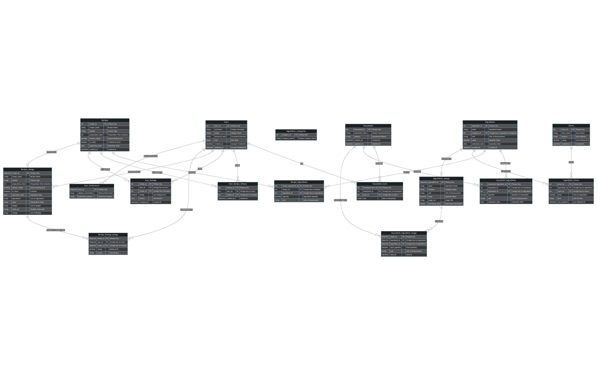

# Introduction

This document provides an in-depth overview of the SQL and NoSQL database design for the Smart Kitchen Helper project. It includes detailed schema diagrams, table definitions, MongoDB collections, thorough explanations of constraints, business rules, logical validations, joins, use case scenarios, and access control details. This design ensures that the system is scalable, maintainable, and capable of efficiently managing the data required for the application's features.

**Author:** Amit Christian  
**Course:** Cloud Computing, Durham College  
**Student ID:** 100937637

# SQL Database Design

## Conceptual Design

The SQL database is designed to handle structured data, such as user profiles, households, ingredients, recipes, and related entities like stores, prices, and ingredient categories. Constraints, rules, and validations are implemented to enforce data integrity and business logic.

### ER Diagram

```{r, echo=FALSE, out.width='120%'}

```

### Entities and Relationships

Below are detailed markdown tables for each SQL entity, including field descriptions, constraints, and use case scenarios.

#### **1. Users Table**

| Field Name        | Data Type       | Constraints                       | Description                                          |
|-------------------|-----------------|-----------------------------------|------------------------------------------------------|
| `user_id`         | `INT`           | `PRIMARY KEY`, `AUTO_INCREMENT`   | Unique identifier for each user.                     |
| `username`        | `VARCHAR(50)`   | `UNIQUE`, `NOT NULL`              | Unique username for user login.                      |
| `email`           | `VARCHAR(100)`  | `UNIQUE`, `NOT NULL`, `CHECK`     | Unique email for communication, must be valid.       |
| `password_hash`   | `VARCHAR(255)`  | `NOT NULL`                        | Encrypted password for security.                     |
| `role`            | `ENUM`          | `NOT NULL`                        | User role, determines permissions and access levels. |
| `created_at`      | `TIMESTAMP`     | `DEFAULT CURRENT_TIMESTAMP`       | Timestamp when the user account was created.         |
| `updated_at`      | `TIMESTAMP`     | `DEFAULT CURRENT_TIMESTAMP ON UPDATE CURRENT_TIMESTAMP` | Timestamp of the last update to the user account. |

**Use Case Scenario:**
- **When:** A new user registers for an account.
- **How:** The user provides their `username`, `email`, and `password`. The system validates the uniqueness of `username` and `email`, encrypts the password, and assigns a default `role` of `Guest` upon successful registration.

---

#### **2. Households Table**

| Field Name        | Data Type       | Constraints                       | Description                                          |
|-------------------|-----------------|-----------------------------------|------------------------------------------------------|
| `household_id`    | `INT`           | `PRIMARY KEY`, `AUTO_INCREMENT`   | Unique identifier for each household.                |
| `household_name`  | `VARCHAR(100)`  | `UNIQUE`, `NOT NULL`              | Unique name for the household.                       |
| `address`         | `VARCHAR(255)`  |                                   | Optional address of the household.                   |
| `created_at`      | `TIMESTAMP`     | `DEFAULT CURRENT_TIMESTAMP`       | Timestamp when the household was created.            |
| `updated_at`      | `TIMESTAMP`     | `DEFAULT CURRENT_TIMESTAMP ON UPDATE CURRENT_TIMESTAMP` | Timestamp of the last update to the household.    |

**Use Case Scenario:**
- **When:** A user with the `Owner` role creates a new household.
- **How:** The `Owner` provides a unique `household_name` and optional `address`. The system ensures the `household_name` is unique across all households and assigns a unique `household_id` upon successful creation.

---

#### **3. Household_Users Table**

| Field Name           | Data Type       | Constraints                       | Description                                          |
|----------------------|-----------------|-----------------------------------|------------------------------------------------------|
| `household_user_id`  | `INT`           | `PRIMARY KEY`, `AUTO_INCREMENT`   | Unique identifier for each household-user relation.  |
| `household_id`       | `INT`           | `FOREIGN KEY`, `NOT NULL`         | Links to the `Households` table.                     |
| `user_id`            | `INT`           | `FOREIGN KEY`, `NOT NULL`         | Links to the `Users` table.                          |
| `role`               | `ENUM`          | `DEFAULT 'member'`                | Defines the user's role within the household.        |

**Use Case Scenario:**
- **When:** An `Owner` adds a new `Member` to their household.
- **How:** The `Owner` selects an existing `User` and assigns them to their household with a `role` of either `Member` or `Owner`. The system ensures that each `User` can only have one `role` per `household`.

---

#### **4. Ingredient_Categories Table**

| Field Name        | Data Type       | Constraints                       | Description                                          |
|-------------------|-----------------|-----------------------------------|------------------------------------------------------|
| `category_id`     | `INT`           | `PRIMARY KEY`, `AUTO_INCREMENT`   | Unique identifier for each ingredient category.      |
| `category_name`   | `VARCHAR(50)`   | `UNIQUE`, `NOT NULL`              | Name of the category (e.g., `Veggie`, `Dairy`).      |

**Use Case Scenario:**
- **When:** A system administrator adds a new category of ingredients.
- **How:** The administrator enters a unique `category_name`, which the system stores in the database. This category can then be associated with ingredients to facilitate organization and search.

---

#### **5. Ingredients Table**

| Field Name        | Data Type       | Constraints                       | Description                                          |
|-------------------|-----------------|-----------------------------------|------------------------------------------------------|
| `ingredient_id`   | `INT`           | `PRIMARY KEY`, `AUTO_INCREMENT`   | Unique identifier for each ingredient.               |
| `name`            | `VARCHAR(100)`  | `NOT NULL`                        | Name of the ingredient (e.g., `Tomato`, `Butter`).   |
| `category_id`     | `INT`           | `FOREIGN KEY`, `ON DELETE SET NULL` | Links to the `Ingredient_Categories` table.       |
| `unit`            | `VARCHAR(50)`   | `NOT NULL`                        | Unit of measurement (e.g., `grams`, `liters`).       |
| `value`           | `DECIMAL(10, 2)`| `NOT NULL`, `CHECK (value >= 0)`  | Quantity of the ingredient.                          |
| `expiration_date` | `DATE`          | `CHECK (expiration_date > CURRENT_DATE)` | Expiration date of the ingredient.             |
| `created_at`      | `TIMESTAMP`     | `DEFAULT CURRENT_TIMESTAMP`       | Timestamp when the ingredient was added.             |

**Use Case Scenario:**
- **When:** A `Member` adds a new ingredient to their household’s inventory.
- **How:** The `Member` specifies the ingredient `name`, `category_id`, `unit`, `value`, and `expiration_date`. The system validates the data, ensuring the `value` is non-negative and the `expiration_date` is in the future. The ingredient is then added to the household’s inventory.

---

#### **6. Stores Table**

| Field Name        | Data Type       | Constraints                       | Description                                          |
|-------------------|-----------------|-----------------------------------|------------------------------------------------------|
| `store_id`        | `INT`           | `PRIMARY KEY`, `AUTO_INCREMENT`   | Unique identifier for each store.                    |
| `store_name`      | `VARCHAR(100)`  | `NOT NULL`                        | Name of the store.                                   |
| `address`         | `VARCHAR(255)`  | `NOT NULL`                        | Physical address of the store.                       |
| `rating`          | `DECIMAL(2, 1)` | `CHECK (rating >= 0 AND rating <= 5)` | Rating of the store (0 to 5).                    |
| `created_at`      | `TIMESTAMP`     | `DEFAULT CURRENT_TIMESTAMP`       | Timestamp when the store was added.                  |

**Use Case Scenario:**
- **When:** An `Owner` or `Administrator` adds a new store to the system.
- **How:** The user provides the `store_name`, `address`, and `rating`. The system validates the `rating` to ensure it falls within the 0 to 5 range. The store is then added to the system for future reference in ingredient pricing.

---

#### **7. Ingredient_Prices Table**

| Field Name        | Data Type       | Constraints                       | Description                                          |
|-------------------|-----------------|-----------------------------------|------------------------------------------------------|
| `price_id`        | `INT`           | `PRIMARY KEY`, `AUTO_INCREMENT`   | Unique identifier for each price entry.              |
| `ingredient_id`   | `INT`          

 | `FOREIGN KEY`, `NOT NULL`         | Links to the `Ingredients` table.                    |
| `store_id`        | `INT`           | `FOREIGN KEY`, `NOT NULL`         | Links to the `Stores` table.                         |
| `price`           | `DECIMAL(10, 2)`| `NOT NULL`, `CHECK (price >= 0)`  | Price of the ingredient at the store.                |
| `unit`            | `VARCHAR(50)`   | `NOT NULL`                        | Unit of the price (e.g., per `kg`, per `liter`).     |
| `last_updated`    | `TIMESTAMP`     | `DEFAULT CURRENT_TIMESTAMP`       | Timestamp when the price was last updated.           |

**Use Case Scenario:**
- **When:** An `Owner` or `Member` updates the price of an ingredient at a specific store.
- **How:** The user selects the ingredient and store, then enters the `price` and `unit`. The system validates that the `price` is non-negative before updating the price information.

---

#### **8. Household_Ingredients Table**

| Field Name           | Data Type       | Constraints                       | Description                                          |
|----------------------|-----------------|-----------------------------------|------------------------------------------------------|
| `household_ingredient_id` | `INT`       | `PRIMARY KEY`, `AUTO_INCREMENT`   | Unique identifier for each household-ingredient relation.  |
| `household_id`       | `INT`           | `FOREIGN KEY`, `NOT NULL`         | Links to the `Households` table.                     |
| `ingredient_id`      | `INT`           | `FOREIGN KEY`, `NOT NULL`         | Links to the `Ingredients` table.                    |
| `quantity`           | `DECIMAL(10, 2)`| `NOT NULL`, `CHECK (quantity >= 0)` | Quantity of the ingredient in the household.      |
| `unit`               | `VARCHAR(50)`   | `NOT NULL`                        | Unit of measurement for the ingredient.              |
| `expiration_date`    | `DATE`          | `CHECK (expiration_date > CURRENT_DATE)` | Expiration date of the ingredient.             |

**Use Case Scenario:**
- **When:** A `Member` manages the ingredients in their household’s inventory.
- **How:** The user can add, update, or delete ingredients, ensuring the `quantity` is non-negative and the `expiration_date` is in the future. The system updates the household’s inventory accordingly.

---

#### **9. Recipes Table**

| Field Name        | Data Type       | Constraints                       | Description                                          |
|-------------------|-----------------|-----------------------------------|------------------------------------------------------|
| `recipe_id`       | `INT`           | `PRIMARY KEY`, `AUTO_INCREMENT`   | Unique identifier for each recipe.                   |
| `recipe_name`     | `VARCHAR(100)`  | `NOT NULL`                        | Name of the recipe (e.g., `Butter Chicken`).         |
| `cuisine`         | `VARCHAR(50)`   |                                   | Type of cuisine (e.g., `Indian`, `Italian`).         |
| `preparation_time`| `INT`           | `CHECK (preparation_time >= 0)`   | Time required to prepare the recipe (in minutes).    |
| `system_rating`   | `DECIMAL(2, 1)` | `CHECK (system_rating >= 0 AND system_rating <= 5)` | System-assigned rating for the recipe. |
| `is_rated`        | `BOOLEAN`       | `DEFAULT FALSE`                   | Indicates if the recipe has been rated by users.     |
| `expiration_date` | `DATE`          | `CHECK (expiration_date > CURRENT_DATE)` | Expiration date of the recipe (if applicable).   |
| `created_at`      | `TIMESTAMP`     | `DEFAULT CURRENT_TIMESTAMP`       | Timestamp when the recipe was added.                 |

**Use Case Scenario:**
- **When:** A `Content Creator` submits a new recipe for approval.
- **How:** The user provides the recipe details, and the system validates the data, ensuring the preparation time is non-negative and the expiration date is valid. The recipe is then marked as `Pending Approval` and awaits review by an `Owner` or `Moderator`.

---

#### **10. Recipe_Ingredients Table**

| Field Name           | Data Type       | Constraints                       | Description                                          |
|----------------------|-----------------|-----------------------------------|------------------------------------------------------|
| `recipe_ingredient_id`| `INT`          | `PRIMARY KEY`, `AUTO_INCREMENT`   | Unique identifier for each recipe-ingredient relation.|
| `recipe_id`          | `INT`           | `FOREIGN KEY`, `NOT NULL`         | Links to the `Recipes` table.                        |
| `ingredient_id`      | `INT`           | `FOREIGN KEY`, `NOT NULL`         | Links to the `Ingredients` table.                    |
| `quantity`           | `DECIMAL(10, 2)`| `NOT NULL`, `CHECK (quantity >= 0)` | Quantity of the ingredient required for the recipe. |
| `unit`               | `VARCHAR(50)`   | `NOT NULL`                        | Unit of measurement for the ingredient.              |

**Use Case Scenario:**
- **When:** A `Content Creator` associates ingredients with a new recipe.
- **How:** The user selects ingredients from the database and specifies the required `quantity` and `unit` for each ingredient. The system ensures that all quantities are non-negative and the units are valid.

---

#### **11. User_Recipe_History Table**

| Field Name           | Data Type       | Constraints                       | Description                                          |
|----------------------|-----------------|-----------------------------------|------------------------------------------------------|
| `history_id`         | `INT`           | `PRIMARY KEY`, `AUTO_INCREMENT`   | Unique identifier for each user-recipe interaction.  |
| `user_id`            | `INT`           | `FOREIGN KEY`, `NOT NULL`         | Links to the `Users` table.                          |
| `recipe_id`          | `INT`           | `FOREIGN KEY`, `NOT NULL`         | Links to the `Recipes` table.                        |
| `cooked_at`          | `TIMESTAMP`     | `DEFAULT CURRENT_TIMESTAMP`       | Timestamp when the user cooked the recipe.           |

**Use Case Scenario:**
- **When:** A `Member` views their cooking history.
- **How:** The system records each time a user cooks a recipe, storing the `user_id`, `recipe_id`, and `cooked_at` timestamp. Users can later review their cooking history and rate or review recipes.

---

#### **12. User_Ratings Table**

| Field Name           | Data Type       | Constraints                       | Description                                          |
|----------------------|-----------------|-----------------------------------|------------------------------------------------------|
| `rating_id`          | `INT`           | `PRIMARY KEY`, `AUTO_INCREMENT`   | Unique identifier for each user rating.              |
| `user_id`            | `INT`           | `FOREIGN KEY`, `NOT NULL`         | Links to the `Users` table.                          |
| `recipe_id`          | `INT`           | `FOREIGN KEY`, `NOT NULL`         | Links to the `Recipes` table.                        |
| `rating`             | `DECIMAL(2, 1)` | `CHECK (rating >= 0 AND rating <= 5)` | User-assigned rating for the recipe (0-5).      |
| `review`             | `TEXT`          |                                   | Optional text review of the recipe.                  |
| `created_at`         | `TIMESTAMP`     | `DEFAULT CURRENT_TIMESTAMP`       | Timestamp when the rating was created.               |

**Use Case Scenario:**
- **When:** A `Member` rates and reviews a recipe they have cooked.
- **How:** The user provides a `rating` and an optional `review` after cooking a recipe. The system validates the rating and stores it along with the `user_id` and `recipe_id`.

---

### Logical Joins and Validations

The following examples illustrate how different entities in the SQL database can be joined to retrieve and manage data efficiently.

#### **1. Viewing Household Ingredients**

```sql
SELECT 
    h.household_name, 
    i.name AS ingredient_name, 
    hi.quantity, 
    hi.unit, 
    hi.expiration_date
FROM 
    Households h
JOIN 
    Household_Ingredients hi ON h.household_id = hi.household_id
JOIN 
    Ingredients i ON hi.ingredient_id = i.ingredient_id
WHERE 
    h.household_id = ?;
```

**Explanation:**  
This query retrieves all ingredients in a specific household, including their quantities, units, and expiration dates. Logical joins ensure that the household, ingredients, and their quantities are correctly linked, and null values are handled by excluding records where necessary.

#### **2. Fetching Store Prices for Ingredients**

```sql
SELECT 
    s.store_name, 
    i.name AS ingredient_name, 
    ip.price, 
    ip.unit, 
    ip.last_updated
FROM 
    Stores s
JOIN 
    Ingredient_Prices ip ON s.store_id = ip.store_id
JOIN 
    Ingredients i ON ip.ingredient_id = i.ingredient_id
WHERE 
    i.ingredient_id = ?;
```

**Explanation:**  
This query retrieves the prices of a specific ingredient across all stores. Logical joins link stores, prices, and ingredients, ensuring that only valid data is returned.

#### **3. Total Ingredients in a Household**

```sql
SELECT 
    COUNT(hi.ingredient_id) AS total_ingredients
FROM 
    Household_Ingredients hi


WHERE 
    hi.household_id = ?;
```

**Explanation:**  
This query returns the total number of different ingredients in a household, ensuring that only valid records are counted and nulls are excluded.

#### **4. Average User Rating for a Recipe**

```sql
SELECT 
    r.recipe_name, 
    AVG(ur.rating) AS average_rating
FROM 
    Recipes r
JOIN 
    User_Ratings ur ON r.recipe_id = ur.recipe_id
WHERE 
    r.recipe_id = ?;
```

**Explanation:**  
This query calculates the average user rating for a specific recipe, ensuring that only valid ratings are included in the calculation.

---

### Access Control Details

Access Control in the Smart Kitchen Helper system is based on Role-Based Access Control (RBAC), where users are assigned specific roles, and their permissions are determined by these roles. This ensures that sensitive operations are restricted to authorized users, maintaining the system’s security and integrity.

#### **Roles and Their Permissions**

| Role          | Access Level      | Permissions                                                     | Restrictions                                              |
|---------------|-------------------|-----------------------------------------------------------------|-----------------------------------------------------------|
| `Guest`       | Limited           | View public recipes, explore the application                    | Cannot modify data, access private household data         |
| `Member`      | Standard          | Manage household ingredients, view and rate recipes             | Cannot manage household settings or approve content       |
| `Owner`       | Elevated          | Full household management, approve or reject content            | Cannot alter system-wide settings or other households     |
| `Moderator`   | Elevated (Global) | Review and moderate user-generated content, approve recipes     | Cannot manage household settings                          |
| `Administrator`| Highest          | Full system access, manage users, roles, global settings        | Reserved for system developers or IT personnel            |
| `Content Creator`| Specialized    | Submit new recipes for approval, update or delete own recipes   | Cannot approve or publish recipes                         |
| `Viewer`      | Read-Only         | View all public content, including recipes and reviews          | Cannot modify or interact with data beyond viewing        |

#### **Scenarios Demonstrating Access Control**

1. **Scenario 1: Adding a New Household Member**
   - **Role:** `Owner`
   - **Action:** An `Owner` adds a new member to their household. The system ensures that only the `Owner` can perform this action, and the new member is assigned the `Member` role by default.

2. **Scenario 2: Submitting a Recipe**
   - **Role:** `Content Creator`
   - **Action:** A `Content Creator` submits a new recipe. The recipe is automatically marked as `Pending Approval`, and the system restricts the Content Creator from publishing it directly. Only a `Moderator` or `Owner` can approve the recipe.

3. **Scenario 3: Accessing User Reviews**
   - **Role:** `Guest`
   - **Action:** A `Guest` user tries to access user reviews for a recipe. The system allows this action since reading reviews is permitted for all roles. However, the `Guest` cannot submit a review.

4. **Scenario 4: Approving a Recipe**
   - **Role:** `Moderator`
   - **Action:** A `Moderator` logs in and reviews a recipe submission. After checking the details, they approve the recipe, making it publicly visible. The system records this action in the audit log.

5. **Scenario 5: Viewing Household Ingredients**
   - **Role:** `Member`
   - **Action:** A `Member` wants to view and update the ingredients in their household. The system grants access to the household inventory and allows the member to make changes, such as updating quantities or removing expired items.

---

### MongoDB (NoSQL) Database Design

## Conceptual Design

The NoSQL database, implemented using MongoDB, is used to store unstructured or semi-structured data such as detailed recipe instructions, ingredient images, and media URLs. MongoDB's flexible schema allows for efficient management of this data type.

### Collections Overview

1. **recipes:** Stores detailed information about recipes, including preparation steps, images, and YouTube video URLs.
2. **ingredients:** Manages images and detailed information for ingredients.
3. **household_ingredient_usage:** Tracks the usage of ingredients within households, including historical usage data.
4. **recipe_ratings:** Collects user ratings and reviews for recipes, allowing for community feedback and recipe improvement.
5. **user_preferences:** Stores user-specific preferences and settings, such as dietary restrictions and preferred cuisines.

---

### MongoDB Collections with Constraints, Rules, Logical Validations, and Relationships

#### **1. Recipes Collection**

```json
{
    "recipe_id": ObjectId("60c72b2f9b1e8a4d5f8e4d67"),
    "recipe_name": "Butter Chicken",
    "cuisine": "Indian",
    "preparation_time": 45,
    "system_rating": 4.5,
    "is_rated": true,
    "expiration_date": ISODate("2023-12-31T00:00:00Z"),
    "ingredients": [
        {
            "ingredient_id": ObjectId("60c72b2f9b1e8a4d5f8e4d68"),
            "name": "Chicken",
            "quantity": 500,
            "unit": "grams"
        },
        {
            "ingredient_id": ObjectId("60c72b2f9b1e8a4d5f8e4d69"),
            "name": "Butter",
            "quantity": 100,
            "unit": "grams"
        }
    ],
    "steps": [
        "Marinate the chicken with spices and yogurt.",
        "Cook the marinated chicken in butter until done.",
        "Prepare the sauce and simmer with chicken."
    ],
    "images": [
        "https://example.com/butter_chicken_step1.jpg",
        "https://example.com/butter_chicken_step2.jpg"
    ],
    "video_url": "https://youtube.com/example_butter_chicken",
    "ratings": [
        {
            "user_id": ObjectId("60c72b2f9b1e8a4d5f8e4d61"),
            "rating": 4.5,
            "review": "Delicious and easy to make!"
        }
    ]
}
```

**Constraints and Rules:**
- **Schema Flexibility:** MongoDB allows for dynamic schemas, so documents can vary within the same collection.
- **Validation:** MongoDB can enforce JSON Schema validation for required fields and data types.
- **Logical Expiration:** Recipes include an expiration date, which could be used to ensure ingredients are still valid or the recipe is still relevant.

**Use Case Scenario:**
- **When:** A `Content Creator` adds a new recipe to the MongoDB collection.
- **How:** The user specifies the recipe details, including ingredients, preparation steps, and an optional video URL. The system validates the JSON document and stores it in the `recipes` collection, where it awaits approval from a `Moderator` or `Owner`.

---

#### **2. Ingredients Collection**

```json
{
    "ingredient_id": ObjectId("60c72b2f9b1e8a4d5f8e4d68"),
    "name": "Chicken",
    "category": "Meat",
    "unit": "grams",
    "value": 500,
    "image_url": "https://example.com/chicken.jpg",
    "nutritional_info": {
        "calories": 200,
        "protein": "20g",
        "fat": "10g",
        "carbohydrates": "0g"
    }
}
```

**Constraints and Rules:**
- **Category Validation:** Ingredients are categorized, which helps in filtering and querying.
- **Unit and Value:** Each ingredient has a unit and a value, helping in accurate inventory management.
- **Optional Fields:** MongoDB allows fields like `nutritional_info` to be optional, providing flexibility.

**Use Case Scenario:**
- **When:** A `Member` adds or updates an ingredient in their household inventory.
- **How:** The user specifies the ingredient details, including category, unit, and value. The system stores this information in the `ingredients` collection, where it can be retrieved for inventory management.

---

#### **3. Household Ingredient Usage Collection**

```json
{
    "usage_id": ObjectId("60c72b2f9b1e8a4d5f8e4d70"),
    "household_id": ObjectId("60c72b2f9b1e8a4d5f8e4d60"),
    "ingredient_id": ObjectId("60c72b2f9b1e8a4d5f8e4d68"),
    "used_quantity": 250,
    "unit": "grams",
    "used_at": ISODate("2023-08-04T14:00:00Z")
}
```

**Constraints and Rules:**
- **Usage Tracking:** Tracks the quantity of ingredients used in households, allowing for detailed inventory management.

**Use Case Scenario:**
- **When:** A `Member` logs the usage of an ingredient in their household.
- **How:** The user records the quantity of the ingredient used and the date of usage. The system updates the `household_ingredient_usage` collection, providing a historical log of ingredient usage.

---

#### **4. Recipe Ratings Collection**

```json
{
    "rating_id": ObjectId("60c72b2f9b1e8a4d5f8e4d71"),
    "user_id": ObjectId("60c72b2f9b1e

8a4d5f8e4d61"),
    "recipe_id": ObjectId("60c72b2f9b1e8a4d5f8e4d67"),
    "rating": 4.5,
    "review": "This recipe was fantastic! The butter chicken turned out perfect."
}
```

**Constraints and Rules:**
- **Rating Validation:** Ratings should be within a 0 to 5 range, which can be enforced through application logic or validation.

**Use Case Scenario:**
- **When:** A `Member` rates and reviews a recipe they have cooked.
- **How:** The user provides a rating and an optional text review. The system validates and stores this information in the `recipe_ratings` collection, contributing to the overall rating of the recipe.

---

#### **5. User Preferences Collection**

```json
{
    "user_id": ObjectId("60c72b2f9b1e8a4d5f8e4d61"),
    "dietary_restrictions": ["Vegetarian", "Gluten-Free"],
    "preferred_cuisines": ["Indian", "Italian"]
}
```

**Constraints and Rules:**
- **Schema Flexibility:** Allows for varying preferences and settings per user.
- **Array Fields:** Supports lists of preferences, providing flexibility in how user data is stored and accessed.

**Use Case Scenario:**
- **When:** A `Member` updates their dietary preferences or preferred cuisines.
- **How:** The user selects or updates their preferences in the system, which stores this data in the `user_preferences` collection. This information can later be used to personalize recipe suggestions.

---

### Summary of Rules, Validations, and System Capabilities

#### **Logical Validations**

1. **Unique Constraints:** Ensure that fields like `username`, `email`, and `category_name` are unique, preventing duplicate entries.
2. **Positive Values and Quantities:** Enforce that numerical values, such as ingredient quantities and prices, are non-negative.
3. **Valid Dates:** Validate that expiration dates for ingredients and recipes are set in the future, ensuring the use of fresh ingredients.
4. **Role-Based Access Control (RBAC):** Assign and enforce roles for users (e.g., Owner, Member, Guest), controlling their actions within the system.
5. **Content Moderation:** Implement an approval workflow for recipes and reviews, ensuring that only high-quality content is visible to users.

#### **Logical Joins and Relationships**

1. **Household Ingredients:** Join `Households`, `Household_Ingredients`, and `Ingredients` to retrieve and manage household inventories.
2. **Store Prices:** Join `Stores`, `Ingredient_Prices`, and `Ingredients` to track and compare prices across different stores.
3. **Recipe Ingredients:** Join `Recipes`, `Recipe_Ingredients`, and `Ingredients` to manage and update recipes.

#### **System Capabilities and Constraints**

### **What the System Can Do:**

1. **Manage Users and Roles:** Create, update, and delete users, assign roles, and enforce RBAC to control access.
2. **Track Ingredients:** Manage household inventories, track expiration dates, and notify users of expiring items.
3. **Moderate and Approve Content:** Manage an approval workflow for user-generated content, ensuring quality and accuracy.
4. **Fetch and Store Prices:** Track ingredient prices across multiple stores, providing users with price comparisons.
5. **Integrate with External APIs:** Fetch cooking videos from YouTube and link them to recipes.

### **What the System Cannot Do:**

1. **Auto-Approve Content:** Content such as recipes and reviews must be manually approved by authorized users before becoming public.
2. **Process Invalid Data:** The system cannot handle invalid or corrupted data entries, such as negative ingredient quantities or past expiration dates.
3. **Override RBAC:** Users cannot perform actions outside their assigned roles, ensuring that sensitive operations are restricted.

---

### Conclusion

This document provides a comprehensive and detailed overview of the Smart Kitchen Helper's SQL and NoSQL database setup, along with logical rules, use case scenarios, access control details, and system capabilities. It serves as a professional design document for developers, architects, and stakeholders involved in the project, ensuring that all data is well-organized, accessible, and logically managed. The system is designed to handle current requirements and future scalability needs, providing a robust backend for the application's features.
```

### Explanation:

- **Detailed Use Case Scenarios:** This section outlines specific scenarios in which the system's features are used, providing practical examples of how the system operates in real-world situations.
  
- **Access Control Details:** The roles and permissions are clearly defined, ensuring that each user interacts with the system in a secure and controlled manner. The scenarios demonstrate how the system enforces these roles, maintaining data integrity and security.

- **Logical Validations, Joins, and Constraints:** Detailed examples and explanations ensure that the data is handled correctly, avoiding common pitfalls such as data corruption or unauthorized access.

This enhanced document provides a comprehensive and thorough guide for implementing the Smart Kitchen Helper's SQL and NoSQL databases, ensuring that the system is both robust and scalable.